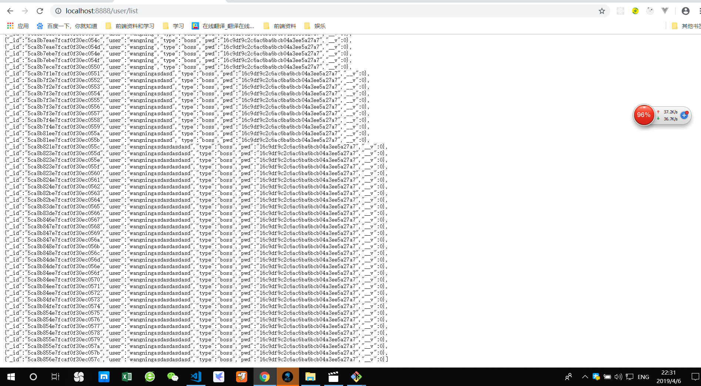
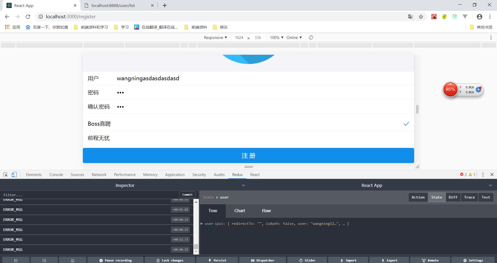
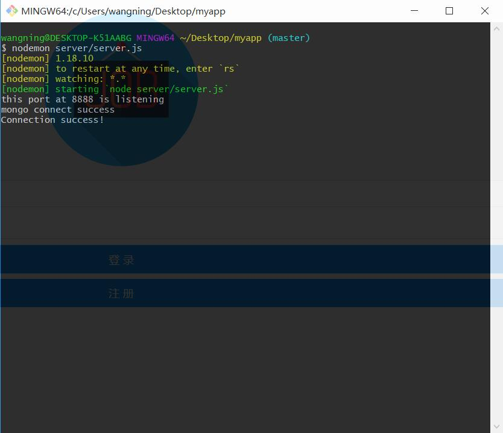

# react全家桶+express+mongoDB开发移动端求职网站

* * *

## 项目运行  
  
* * *
>1.执行npm install安装依赖包  
>2.前端启动 npm start  
>3.后端启动 nodemon server/server.js  
>4.安装mongoDB数据库  

* * *
>数据库数据入库查看页面 localhost:8888/user/list      

###   

* * *
>后端返回  
>code：状态码  
>>1.code:0 成功      
>>2.code:1 错误      
>data：具体数据    
>msg：错误信息    

## 加密
>加密使用MD5+salt，第三方库utility  
>`npm install utility --save`  

## 静态检查
>React可以通过第三方库prop-types，使用static方法定义类型，防止传入的类型不正确，并抛出一个err  
>`npm i prop-types --save`  


npm依赖  
-------------------------------
##利用官方脚手架创建的依赖
> ```create-react-app```  
> ```npm install express --save```  
*git初始化本地仓库后（不初始化会报错）  
> ````git init````  
> ```git add```  
> ```git commit```  
> ```npm run eject //释放配置```  
> ```npm install //不运行会报错```  
> ```npm install express --save```  
> *创建server文件夹下的server.js  
> *定义端口为8888  
> *利用nodemon进行端口热更替     
> ```npm install -g nodemon```  
> *安装mongoDB数据库，打开bin文件夹  mongodb.exe（windows）  
> *安装mongoose操作数据库  
> ```npm install mongoose --save```  
> *开启nodemon  
> ```nodemon 文件名```  
> *使用antd-mobile  
> ```npm install antd-mobile --save```  
> *安装babel-plugin-import  
> ```npm install babel-plugin-import --save```     
> 
### 项目心得  
>绑定this，bind方法比箭头函数的性能更好，箭头函数每次都会扫描对象  
>conbinreducer可以合并多个reduce,并返回一个新的reducer  
>connect(mapStateToProps, mapDispatchToProps)（）可以把ui组件链接到外部组件上  
>>mapStateToProps: 建立一个从（外部的）state对象到（UI组件的）props对象的映射关系。    
>>mapDispatchToProps:   建立UI组件的参数到store.dispatch方法的映射   
>>前端屏蔽pwd，通过从返回data中分离pwd  
>>
`const {pwd,...data}=obj`  


* * *
>bug：  
1.   
>后端代码用户注册数据入库重复    




* * *

2.   
>返回了errormessage，并未前台并未显示提示内容   

  
     

* * *
mongodb数据库报错
>前台post请求得不到响应，查看了后台代码，后台报错mongodb使用了最新的字符串解析器，查看文档后补充代码，仍然报错connect fail ，原因是进程一直在运行数据库，关机后被锁定，mongod实例化path使用cmd重新写入路径，最后重启mongod和mongo  

  

